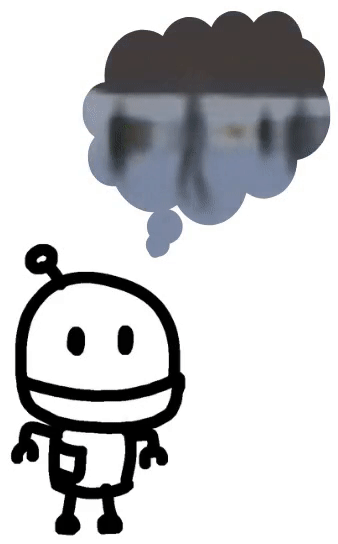
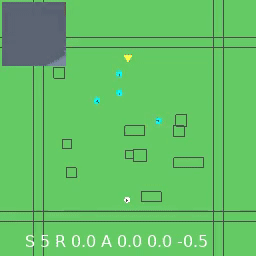
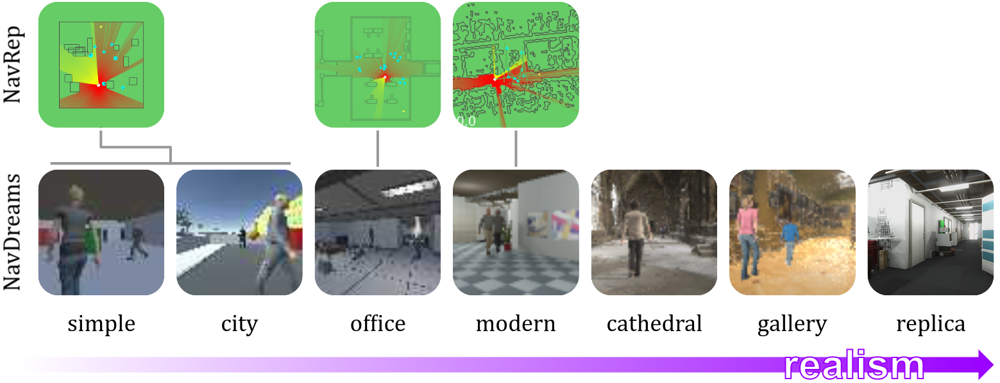

Status: Unstable! Release in progress.

# NavDreams

Camera-based robot navigation simulator, world-models, and policies for the paper
**NavDreams: Towards Camera-Only RL Navigation Among Humans**




In NavDreams, we use the world-model/dreamer concept to learn a model which predicts the future,
then use this world model to do camera-based robot navigation.


More information available in [our paper](TODO)

## Simulator

Our simulator currently contains 7 scenarios. Some of these are based on 2D environments from [previous work](https://www.github.com/danieldugas/navrep).



<!-- To find out how to modify the simulator for your own needs, follow [this link](https://www.github.com/danieldugas/WaveEnv) -->

## Models and Tools

Model implementations, trained checkpoints, training tools, and plotting tools are made available in this repo.


# How-to

- Manual Install
- Running the simulator
- Training the world-model
- Training the controller

## Manual Install

```
pip install navdreams
```

## Running the simulated environments

```
python -m navdreams.navrep3danyenv --scenario replica
```

## Training the World-Model

Generate the dataset

```
python make_vae_dataset.py --scope SCR
```

Train the world-model

```
python train_gpt.py --dataset SCR
```

## Training the Controller

```
python train_gym_discrete_navrep3dtrainencodedenv.py --variant SCR --scenario city
```

---

## Server Install

System check:

```
docker run -it --rm --gpus all pytorch/pytorch:1.9.0-cuda10.2-cudnn7-devel nvidia-smi
```

Build Container
```
docker build -t navdreams .
```

Train E2E model
```
docker run -it --rm --gpus all -v ~/logdir:/logdir navdreams \
  python3 train_gym_discrete_e2enavrep3d_PPO.py
```

Note that due to using Unity as the simulation backend (MLAgents), a visual environment is required
Here's an example on how to start the XServer on a ubuntu server with a Tesla T4 GPU.
[Read here](https://dugas.ch/lord_of_the_files/run_your_unity_ml_executable_in_the_cloud.html) for more details.

```
# create virtual display with nvidia drivers
# nvidia-xconfig --query-gpu-info
# With headless GPUs (e.g. Tesla T4), which don't have display outputs, remove the --use-display-device=none option
# sudo nvidia-xconfig --busid=PCI:0:30:0 --use-display-device=none --virtual=1280x1024
sudo nvidia-xconfig --busid=PCI:0:30:0 --virtual=1280x1024
sudo Xorg :0 & # unlike startx, this only starts the x server, no DEs
nvidia-smi # check that Xorg is running on the GPU
echo "export DISPLAY=:0" >> ~/.bashrc # applications need to know which display to use
```
