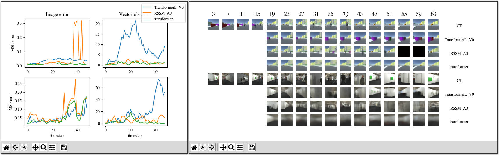

# Example Workflow: Evaluating World-model Dreams

### Install

[This install script](../install_dependencies.sh) is an example of how to get the necessary dependencies,
as well as pydreamer and NavDreams code and python libraries installed in development mode

### Download Existing Dataset
Download the [navdreams_data](https://drive.google.com/drive/folders/17_o7jPLKKlRbgySIOxn6-Z1kUHcOgld5?usp=sharing)
folder to your home directory so that `~/navdreams_data/wm_experiments` is a valid location.

Note that this is quite a large download, you can potentially only download the parts which you requre to save on space.

(Alternatively, you can generate the datasets using the simulator.
Afterwards, make sure to move them to the location expected by the script e.g. `~/navdreams_data/wm_test_data`)
```
python make_vae_dataset.py --scope SCR
```

### Run The Dream Error Script

In test_n_step dream, dream sequences are generated by world-models, and then compared using pixel-wise error,
as well as plotted for visualization.

First, make sure you source the virtualenv
```
source ~/n3denv/bin/activate
cd ~/Code/NavDreams
```

Now you should be able to run the evaluation script
```
python test_n_step_dream.py
```

Which outputs the dream predictions, and errors for a couple of example sequences



Running with the flag `--error` computes the same error on the whole dataset

```
python test_n_step_dream.py --error
```

Other flags (for example `--gifs`, allowing to create dream gifs) can be found directly in [test_n_step_dream.py](../test_n_step_dream.py)
